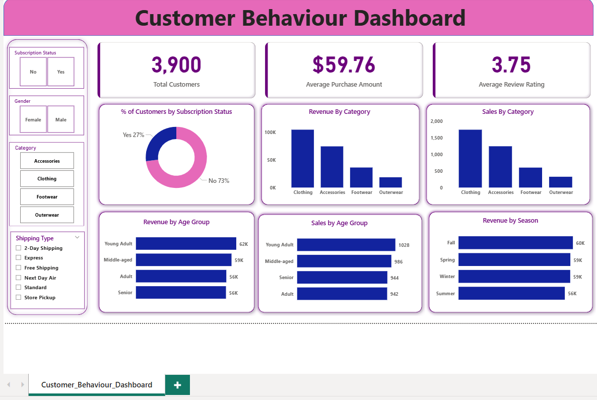

# Customer_Behaviour_Analysis

## 📌 Project Overview

This project analyzes customer shopping behavior using Python, SQL Server, and Power BI. The goal was to clean and transform raw customer data, perform exploratory data analysis (EDA), generate business insights through SQL queries, and build an interactive dashboard for decision-making.

## Tools & Technologies

- Python
- Pandas
- NumPy
- SQL Server
- SQLAlchemy
- Power BI
- Jupyter Notebook / VS Code

## Project Workflow

### Data Cleaning & Preparation (Python)

- Loaded raw customer shopping dataset
- Handled missing values
- Standardized text values
- Created additional derived columns
- Performed data preprocessing and validation
### SQL Analysis

The cleaned dataset was loaded into SQL Server for business analysis.

#### Business Questions Answered

1. Revenue by category
2. Sales by category
3. Revenue by age group
4. Sales by age group
5. Subscription status analysis
6. Seasonal revenue analysis
7. Product performance analysis
8. Discount impact analysis
9. Customer segmentation analysis
10. Top-performing categories

### Power BI Dashboard

Built an interactive dashboard to visualize customer behavior and business performance.

## Key Performance Indicators (KPIs)

| KPI | Value |
|------|------|
| Total Customers | 3,900 |
| Average Purchase Amount | $59.76 |
| Average Review Rating | 3.75 |

## Dashboard Features

- Subscription Status Analysis
- Revenue by Category
- Sales by Category
- Revenue by Age Group
- Sales by Age Group
- Revenue by Season
- Interactive Slicers:
  - Gender
  - Category
  - Shipping Type
  - Subscription Status

## Key Insights

- Clothing generated the highest revenue among all categories.
- Young Adults contributed the highest revenue.
- Fall season generated the highest revenue.
- Most customers were non-subscribers.
- Average customer review rating remained above 3.7.
## Dashboard Preview

  

## Project Structure

```text
Customer-Behaviour-Analysis/
│
├── customer_behaviour_analysis.ipynb
├── customer_shopping_cleaned.csv
├── sql_queries.sql
├── Customer_Behaviour_Dashboard.pbix
├── dashboard.png
└── README.md
```

## Author

**Shilpa Dash**
